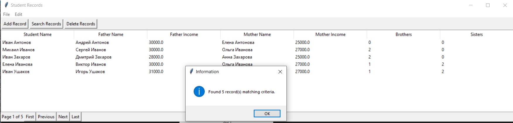

# Лабораторная работа №2. Вариант 10
### Описание программы
---
Программа предназначена для управления данными о студентах и их семьях с помощью графического интерфейса и XML файлов. Реализован функционал поиска и удаления по имени студента, ФИО родителей, доходам родителей и количеству братьев и сестер.

### Демонстрация работы программы
Главное окно программы представлено в виде таблицы со столбцами Имя студента, Имя отца, Доход отца, Имя матери, Доход матери, Количество братьев, Количество сестер. Также на главном окне присутствуют различные кнопки управления и инструменты для работы с базой (создание файла, открытие, добавление записи, поиск по фильтру и удаление по фильтру).


 ### Работа с данными
 Программа поддерживает работу с видом файла - `.xml`.

### Добавление записи
Для добавления записи необходимо нажать Add Record. Открывается окно, в котором пользователь может ввести данные о студенте и его семье


В данной процедуре добавления обработаны такие ошибки, как:
```
- ФИО студента, или его родителя не может содержать цифры и иные символы, не принадлежащие к буквам.
- нельзя оставлять пустые поля
```
### Поиск записи
В данной программе реализована логика поиска студента. Студента можно найти по одному или нескольким нижеперечисленным критерям:
- по ФИО студента (Может быть заполнен только один элемент ФИО, например имя);
- по ФИО одного из родителей. (Может быть заполнен только один элемент ФИО, например имя);
- по числу братьев или сестер;
-по размеру заработка одного из родителей (Задается нижняя или верхняя граница, или обе)
Результат поиска отображается в главном окне, а так же в маленьком окне отображается количество найденых студентов, которые подходят по критериям.


### Удаление записи
Алгоритм удаления идентичен алгоритму поиска. Студента можно удалить по одному или нескольким нижеперечисленным критерям:
- по ФИО студента (Может быть заполнен только один элемент ФИО, например имя);
- по ФИО одного из родителей. (Может быть заполнен только один элемент ФИО, например имя);
- по числу братьев или сестер;
-по размеру заработка одного из родителей (Задается нижняя или верхняя граница, или обе)
Количество удаленных, подходящих под критерии, студентов отображается в маленьком окне.

